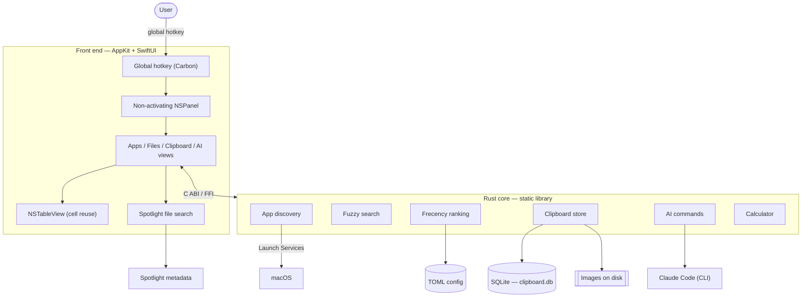

<p align="center">
  
</p>

<h1 align="center">Ainto</h1>

<p align="center">
  <strong>A lightweight, open-source macOS launcher with built-in AI commands.</strong><br>
  <em>The Spotlight & Raycast alternative for engineers who keep it simple.</em>
</p>

<p align="center">
  <a href="https://ainto.app">Website</a> &middot;
  <a href="https://github.com/ainto-labs/ainto-app/issues">Issues</a> &middot;
  <a href="#features">Features</a> &middot;
  <a href="#build">Build</a>
</p>

<p align="center">
  English &middot; <a href="README.zh-TW.md">正體中文</a>
</p>

<p align="center">
  <a href="https://github.com/ainto-labs/ainto-app/releases/latest/download/Ainto.dmg">
    
  </a>
</p>

---

> [!IMPORTANT]
> This is the personal GPLv3 downstream fork maintained at
> [kerryandjry/ainto-app](https://github.com/kerryandjry/ainto-app), based on
> [Ainto by ainto-labs](https://github.com/ainto-labs/ainto-app).
> The download button above is the **original upstream app**, not this fork.
> This fork removes Snippets (including global text expansion); existing
> `snippets.toml` data is left untouched and legacy snippet aliases are inactive.
> Updates are manual: the upstream Sparkle feed is disabled to prevent replacing
> this build with the original app. Build locally; no signed/notarized downstream
> distributable is offered yet. See [downstream notes](docs/downstream.md).

## Features

| Feature | Description |
| --------- | ------------- |
| **App Search** | Fuzzy search, frecency ranking, explicit Home pins, and configurable Home items |
| **File Search** | Spotlight-backed search across selected folders or the entire Mac, with native file actions |
| **Aliases & Shortcuts** | Assign Unicode-aware aliases or global hotkeys to apps and launcher targets |
| **Instant Answers** | Local calculator results and on-demand, cached currency conversion |
| **System Actions** | Run allowlisted macOS actions; destructive actions always require confirmation |
| **Process Search** | Type `kill <name-or-pid>` to find an owned process and explicitly confirm `SIGKILL` |
| **AI** | Press Tab to chat, or select text → run & replace (Fix Grammar, Translate, Summarize, or your own) |
| **Clipboard History** | Persistent history with text, image, and file support |
| **Native Launcher UI** | Keyboard-first navigation, cursor-display positioning, and stable top-left panel geometry |

> **AI & billing:** Ainto runs the Claude Code CLI on your Mac (`claude -p`), so AI usage is billed to your own Claude account — Ainto stores no API key and never charges you. See [how Claude meters Agent SDK / `claude -p` usage](https://support.claude.com/en/articles/15036540-use-the-claude-agent-sdk-with-your-claude-plan).

### Safety and privacy

- File Search uses Spotlight metadata; Ainto never recursively crawls your disk.
- Full Disk Access controls permission and does not silently expand the configured search scope.
- Process termination is opt-in: only `kill` followed by a space activates Process Search; exact `kill` remains ordinary search. Return arms a candidate, and `⌘↵` confirms. Ainto revalidates PID, owner, executable path, and start time immediately before signalling and excludes protected system processes.
- Clipboard data stay under `~/.config/ainto/`. Clipboard representations are preserved when Ainto temporarily pastes generated text.
- There is no telemetry, Electron runtime, WebView, or bundled AI inference service.

### Permissions

Some optional features need macOS privacy permissions:

- **Accessibility:** selected-text capture/replacement.
- **Full Disk Access:** only when you want Spotlight results from protected locations.

App Search, launcher navigation, calculator answers, and other local features do not require Full Disk Access.

## Under the hood

Ainto is a native macOS app: an AppKit + SwiftUI front end over a Rust core, bridged through a C ABI. No Electron, no web view.



- **Rust core.** App discovery, fuzzy search, frecency ranking, the clipboard store, and AI commands all live in a single Rust static library linked into the app.
- **App and file discovery.** Apps are enumerated through Launch Services and ranked with a frecency model. File Search queries Spotlight on demand rather than maintaining another index.
- **Clipboard store.** Backed by SQLite. Images are written to disk and referenced by path rather than stored in the database, and every entry is deduplicated with an XXH3 content hash. Text and images keep independent retention limits, so heavy text copying never evicts your image history.
- **Clipboard list.** An `NSTableView` with cell reuse, fed by paginated and debounced SQLite queries — the list scrolls and searches smoothly however large the history grows.
- **Input.** A non-activating `NSPanel` that preserves the foreground app. The launcher and optional target shortcuts use registered system hotkeys.
- **Local-first.** Everything lives under `~/.config/ainto/` — SQLite for clipboard history, TOML for config, AI commands, and rankings. No telemetry.
- **Updates.** This downstream build uses manual updates. The upstream Sparkle feed is disabled; local ad-hoc builds are not notarized.

## Build

```bash
# Quick dev build
./build.sh

# Full build, run, and more
make help
```

## Requirements

- macOS 14.0+
- Xcode 15+
- Rust toolchain (`rustup`)

## License

[GPL-3.0-or-later](LICENSE) — Ainto is free software: any fork or derivative must remain open-source under the same license.

---

<p align="center">
  Built by <a href="https://github.com/ainto-labs">Ainto Labs</a>
</p>
