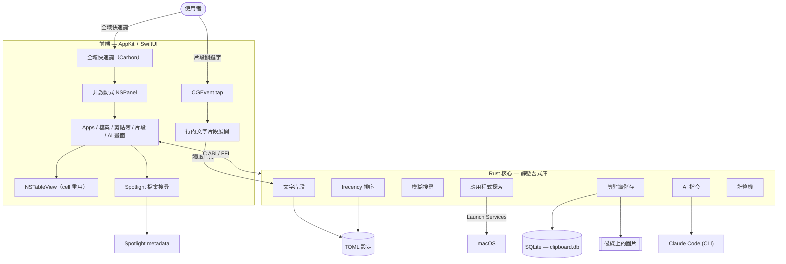

<p align="center">
  
</p>

<h1 align="center">Ainto</h1>

<p align="center">
  <strong>輕量、開源、內建 AI 指令的 macOS 啟動器。</strong><br>
  <em>為喜歡保持簡單的工程師打造的 Spotlight 與 Raycast 替代方案。</em>
</p>

<p align="center">
  <a href="https://ainto.app">官網</a> &middot;
  <a href="https://github.com/ainto-labs/ainto-app/issues">問題回報</a> &middot;
  <a href="#功能">功能</a> &middot;
  <a href="#建置">建置</a>
</p>

<p align="center">
  <a href="README.md">English</a> &middot; 正體中文
</p>

<p align="center">
  <a href="https://github.com/ainto-labs/ainto-app/releases/latest/download/Ainto.dmg">
    
  </a>
</p>

---

> [!IMPORTANT]
> `local/integrated-testing` 是個人使用的整合測試分支，用來在功能拆成聚焦的上游 PR
> 之前進行完整驗證。上方下載按鈕指向上游正式版本，不一定包含下列所有功能。

## 功能

| 功能 | 說明 |
| ------ | ------ |
| **應用程式搜尋** | 模糊搜尋、frecency 排序、明確釘選 Home app，以及可設定的 Home Items |
| **檔案搜尋** | 使用 Spotlight 搜尋指定資料夾或整台 Mac，並提供原生檔案操作 |
| **別名與快速鍵** | 將支援 Unicode 的別名或全域快速鍵指派給 app 與 launcher target |
| **即時答案** | 本機計算機，以及按需取得並快取的匯率換算 |
| **系統操作** | 執行 allowlist 內的 macOS 操作；破壞性操作一定需要確認 |
| **行程搜尋** | 輸入 `kill <名稱或 PID>` 尋找自己擁有的行程，並明確確認 `SIGKILL` |
| **AI** | 按 Tab 開始對話，或選取文字後執行並取代（修正文法、翻譯、摘要，或自訂指令） |
| **剪貼簿歷史** | 持久化的歷史記錄，支援文字、圖片與檔案 |
| **文字片段** | 搜尋、預覽及貼上模板，亦可啟用支援動態佔位符的全域展開（`{date}`、`{clipboard}`、`{time}`、`{uuid}`） |
| **原生 Launcher UI** | 鍵盤優先導覽、游標所在螢幕定位，以及穩定維持頂端位置的 panel geometry |

> **AI 與計費：** Ainto 透過你 Mac 上的 Claude Code（`claude -p`）執行 AI，用量計入你自己的 Claude 帳號。Ainto 不儲存 API key，也不向你收費。計費方式請見 [Claude 對 Agent SDK 與 `claude -p` 用量的說明](https://support.claude.com/en/articles/15036540-use-the-claude-agent-sdk-with-your-claude-plan)。

### 安全與隱私

- 檔案搜尋使用 Spotlight metadata；Ainto 不會遞迴爬取磁碟。
- Full Disk Access 只控制權限，不會暗中擴大設定好的搜尋範圍。
- 終止行程必須明確選擇：只有 `kill ` 會啟動 Process Search，Return 進入準備狀態，`⌘↵` 才會確認。送出 signal 前會重新驗證 PID、擁有者、執行檔路徑與啟動時間，並排除受保護的系統行程。
- 剪貼簿與文字片段資料都保存在 `~/.config/ainto/`。Ainto 暫時貼上產生的文字時，會保留原本的剪貼簿 representations。
- 沒有遙測、Electron runtime、WebView 或內建 AI inference service。

### 權限

部分選用功能需要 macOS 隱私權限：

- **輔助使用：** 選取文字的擷取／取代，以及全域文字片段展開。
- **輸入監控：** 全域文字片段展開。
- **完整磁碟存取權：** 只有需要從受保護位置取得 Spotlight 結果時才需要。

應用程式搜尋、launcher 導覽、計算機答案及其他本機功能不需要完整磁碟存取權。

## 技術架構

Ainto 是一個原生 macOS 應用程式，以 AppKit + SwiftUI 為前端，底層是 Rust 核心，兩者透過 C ABI 橋接。沒有 Electron，也沒有 web view。



- **Rust 核心。** 應用程式探索、模糊搜尋、frecency 排序、剪貼簿儲存、文字片段展開與 AI 指令，全部位於一個連結進 app 的 Rust 靜態函式庫中。
- **應用程式與檔案探索。** 透過 Launch Services 列舉 app，再以 frecency 模型排序。檔案搜尋按需查詢 Spotlight，不維護另一份索引。
- **剪貼簿儲存。** 以 SQLite 為後端。圖片寫入磁碟並以路徑引用，而非存進資料庫；每一筆都以 XXH3 內容雜湊去除重複。文字與圖片各有獨立的保留上限，因此大量複製文字不會擠掉圖片歷史。
- **剪貼簿清單。** 採用會重用 cell 的 `NSTableView`，由分頁且經過 debounce 的 SQLite 查詢餵入資料；無論歷史成長到多大，捲動與搜尋都保持流暢。
- **輸入。** 非啟動式 `NSPanel` 會保留前景 app。Launcher 與選用的 target shortcuts 使用註冊的系統快速鍵，選用的行內文字片段展開則使用 `CGEvent` tap。
- **本地優先。** 所有資料都存在 `~/.config/ainto/` 之下：剪貼簿歷史用 SQLite，設定、片段、AI 指令與排序則用 TOML。無遙測。
- **更新。** 建置產物皆經簽署、公證，並透過 [Sparkle](https://sparkle-project.org/) 派送。

## 建置

```bash
# 快速開發建置
./build.sh

# 完整建置、執行與更多指令
make help
```

## 系統需求

- macOS 14.0+
- Xcode 15+
- Rust 工具鏈（`rustup`）

## 授權

[GPL-3.0-or-later](LICENSE)。Ainto 是自由軟體：任何分支或衍生作品都必須以相同授權維持開源。

---

<p align="center">
  由 <a href="https://github.com/ainto-labs">Ainto Labs</a> 打造
</p>
